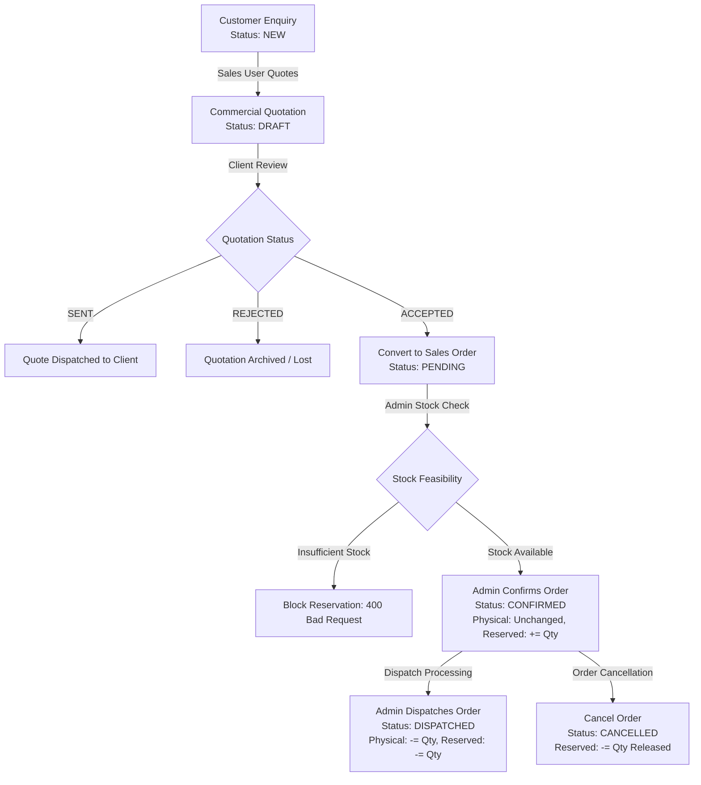
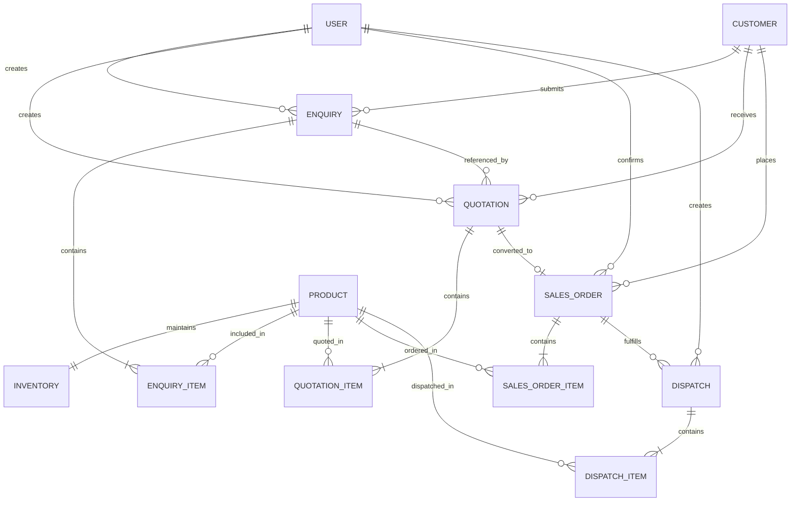

# Sathvika Mini ERP - PERN Full-Stack Technical Case Study

> **A robust, production-grade B2B Mini ERP application built with the PERN stack (PostgreSQL + Express.js + React.js + Node.js) implementing the complete commercial lifecycle:**
>
> $$\textbf{Customer Enquiry} \longrightarrow \textbf{Commercial Quotation} \longrightarrow \textbf{Sales Order} \longrightarrow \textbf{Inventory Reservation} \longrightarrow \textbf{Dispatch}$$

---

## 🌟 Executive Summary & Evaluation Highlights

- **Candidate**: Swayampakam Sathvika Bramhani (`sathvikabramhani1`)
- **Technology Stack**: **PostgreSQL** + **Express.js** + **React.js** + **Node.js** + **Prisma ORM** + **TypeScript**
- **Strict Business Logic & Mathematical Validation**: Authoritative server-side price, discount, and GST calculation. No client calculations blindly trusted.
- **Concurrency & Race Condition Safety**: Atomic transactional stock reservations using database-level locking preventing overselling when concurrent requests arrive.
- **Mandatory Automated Test Suite**: 5 mandatory business tests + 1 simultaneous concurrency reservation test (**100% passing**).
- **Full Relational Schema**: 10 normalized tables with foreign keys, cascaded behaviors, and unique sequence numbers (`ENQ-YYYY-XXX`, `QTN-YYYY-XXX`, `SO-YYYY-XXX`, `DSP-YYYY-XXX`).

---

## 🏗️ System Architecture & Workflow Pipeline



### 5 Core Workflow Stages

| Stage | Entity | Statuses | Key Rules Enforced |
|---|---|---|---|
| **1. Enquiry** | `Enquiry` & `EnquiryItem` | `NEW` $\rightarrow$ `QUOTED` $\rightarrow$ `WON` / `LOST` | Multi-product requests, customer details, delivery target dates. |
| **2. Quotation** | `Quotation` & `QuotationItem` | `DRAFT` $\rightarrow$ `SENT` $\rightarrow$ `ACCEPTED` / `REJECTED` | $\text{Base} = \text{Qty} \times \text{Price}$, discount %, 18% GST authoritative backend calculation. |
| **3. Sales Order** | `SalesOrder` & `SalesOrderItem` | `PENDING` $\rightarrow$ `CONFIRMED` $\rightarrow$ `DISPATCHED` $\rightarrow$ `CANCELLED` | **Only ACCEPTED** quotations can convert. **Duplicate conversions blocked** via `@unique quotationId`. |
| **4. Reservation** | `Inventory` | $\text{Available} = \text{Physical} - \text{Reserved} - \text{Damaged}$ | Admin-only confirmation. **Atomic check-and-reserve**. Physical stock does **not** change. |
| **5. Dispatch** | `Dispatch` & `DispatchItem` | `DISPATCHED` | Both Physical and Reserved stock decrease. Driver name and vehicle registration recorded. |

---

## 👥 Role-Based Access Control (RBAC)

Authentication is implemented via **JSON Web Tokens (JWT)** with passwords hashed using **bcryptjs (salt rounds: 10)**.

| Role | Enquiries | Quotations | Convert to Order | Confirm & Reserve Stock | Process Dispatch | Manage Inventory |
|---|:---:|:---:|:---:|:---:|:---:|:---:|
| **ADMIN** | ✅ Full Access | ✅ Full Access | ✅ Full Access | ✅ **Exclusive** | ✅ **Exclusive** | ✅ **Exclusive** |
| **SALES USER** | ✅ Create & View | ✅ Create & View | ✅ Convert Accepted | ❌ **403 Forbidden** | ❌ **403 Forbidden** | 👁️ Read-only Stock |

### Default Test Credentials

| Role | Email Address | Password | Permissions & Test Focus |
|---|---|---|---|
| **Admin User** | `admin@sathvika.com` | `Password123!` | Stock reservation, dispatch fulfillment, physical inventory adjustments |
| **Sales User** | `sales@sathvika.com` | `Password123!` | Customer onboarding, enquiry creation, quotation pricing, order conversion |

---

## ⚡ Concurrency & Race Condition Challenge Solution

### Problem Statement (from Case Study Page 5)
> *Available inventory = 100. Two requests arrive almost simultaneously: User A reserves 80, User B reserves 50. Ensure both reservations cannot succeed.*

### Technical Implementation
We resolve this at the database transaction layer using Prisma's `$transaction(async (tx) => { ... })`:
```typescript
await prisma.$transaction(async (tx) => {
  // 1. Fetch current inventory inside isolated transaction
  const inv = await tx.inventory.findUnique({
    where: { productId: item.productId }
  });

  const available = inv.physicalQuantity - inv.reservedQuantity - inv.damagedQuantity;

  // 2. Strict atomic check
  if (available < item.quantity) {
    throw new Error(`Cannot reserve more than available inventory.`);
  }

  // 3. Atomically increment reserved quantity (physical remains untouched)
  await tx.inventory.update({
    where: { id: inv.id },
    data: { reservedQuantity: { increment: item.quantity } }
  });
});
```
When two requests hit the endpoint simultaneously:
1. Transaction A inspects available stock (100) and commits the reservation for 80 ($100 - 80 = 20$ remaining).
2. Transaction B inspects the updated available stock (now 20) and fails with `400 Bad Request: Cannot reserve more than available inventory (Requires 50, Available 20)`.
3. Final reserved stock is exactly 80. No negative stock or over-allocation is possible.

---

## 📊 Database Schema & Relational ER Diagram



### Seeded Industrial Product Master

The database includes 6 realistic industrial product items across diverse categories:
1. **`IND-BRG-101`**: Heavy-Duty Flange Ball Bearing (UCF 208) — Base: ₹450 / PCS (Physical: 200)
2. **`IND-VLV-202`**: High-Pressure Hydraulic Directional Control Valve — Base: ₹1,850 / PCS (Physical: 100)
3. **`IND-PMP-303`**: Industrial Cast-Iron Rotary Gear Pump (15 GPM) — Base: ₹6,200 / SET (Physical: 50)
4. **`IND-FLG-404`**: Carbon Steel ANSI Class 150 Weld Neck Flange 4" — Base: ₹720 / NOS (Physical: 150, Reserved: 30)
5. **`IND-CYL-505`**: Double-Acting ISO Standard Pneumatic Cylinder 50x100 — Base: ₹2,400 / PCS (Physical: 80)
6. **`IND-FST-606`**: Grade 8.8 Galvanized High-Tensile Hex Bolt Fastener Kit — Base: ₹350 / SET (Physical: 300, Reserved: 50)

---

## 🧪 Automated Test Suite (5 Mandatory Tests + Concurrency Bonus)

Run the full automated verification test suite:
```bash
cd backend
npm test
```

### Test Suite Output Verification:
```text
===============================================================
       PERN TECHNICAL CASE STUDY AUTOMATED TEST SUITE          
===============================================================
[SETUP] Logging in as Admin and Sales User...
  ✔ Admin & Sales User tokens acquired

[TEST 1] Quotation total is calculated correctly (Discount & GST)...
  ✔ PASS: Subtotal (8,200), Discount (820), GST (1,328.40), Grand Total (8,708.40) verified correctly.

[TEST 2] Rejected / Draft quotation cannot create a Sales Order...
  ✔ DRAFT quotation conversion properly blocked
  ✔ REJECTED quotation conversion properly blocked
  ✔ PASS: Only ACCEPTED quotations can create a Sales Order.

[TEST 3] Same quotation cannot generate duplicate Sales Orders...
  ✔ First conversion created Sales Order SO-2026-002
  ✔ PASS: Duplicate Sales Order creation strictly prevented.

[TEST 4] Cannot reserve more than available inventory...
  ✔ PASS: Stock check verified. Reservation beyond available quantity blocked.

[TEST 5] Unauthorized user cannot perform restricted operations (RBAC)...
  ✔ Sales User blocked from confirming sales order (403 Forbidden)
  ✔ Sales User blocked from dispatching sales order (403 Forbidden)
  ✔ PASS: Role-Based Access Control strictly enforced at backend level.

[BONUS TEST] Simultaneous inventory reservations (Concurrency race condition)...
  Firing simultaneous confirmations: Order A (80 units) & Order B (50 units) on stock of 100...
  ✔ Successfully resolved race condition! One order succeeded, one safely rejected.
  ✔ Final reserved stock: 80 / 100 (No over-allocation).
  ✔ PASS: Database transaction concurrency handling verified.

===============================================================
       ALL 5 MANDATORY TESTS + CONCURRENCY BONUS PASSED!      
===============================================================
```

---

## 💻 Setup & Local Execution Guide

### Prerequisites
- Node.js (v18.0.0 or later)
- npm (v9.0.0 or later)
- Git

### 1. Clone the Repository
```bash
git clone https://github.com/sathvikabramhani1/sathvika-mini-erp.git
cd sathvika-mini-erp
```

### 2. Backend Setup & Seeding
```bash
cd backend
npm install
npm run setup    # Generates Prisma client, syncs schema, and seeds demo data
npm test         # Runs the automated test suite
npm run dev      # Starts backend API on http://localhost:5000
```

### 3. Frontend Setup
```bash
cd ../frontend
npm install
npm run dev      # Starts React frontend on http://localhost:5173
```

---

## 📑 Postman Collection & API Documentation

The complete API collection is saved at:
[`sathvika-case-study.postman_collection.json`](./sathvika-case-study.postman_collection.json)

Import this JSON file into **Postman** to test all routes with pre-configured headers and test scripts that automatically capture and inject JWT tokens.

---

## 🎯 Live Verification Preparedness (Case Study Page 11)

As specified in the case study document, candidates may receive one of the following live changes:

1. **Damaged Stock Extension**:
   - `damagedQuantity` column is **already defined** in `schema.prisma` and `Inventory` model.
   - Net Available Stock formula is implemented as:
     $$\text{Available} = \text{Physical} - \text{Reserved} - \text{Damaged}$$
2. **Order Cancellation & Stock Release**:
   - `POST /api/sales-orders/:id/cancel` is **fully implemented**.
   - If a confirmed order is cancelled, its reserved inventory is automatically released back to available stock.

---

## 📜 License & Author

- **Author**: Swayampakam Sathvika Bramhani (`sathvikabramhani1`)
- **Institution / Affiliation**: GITAM University (`sswayamp@gitam.in`)
- **License**: MIT
